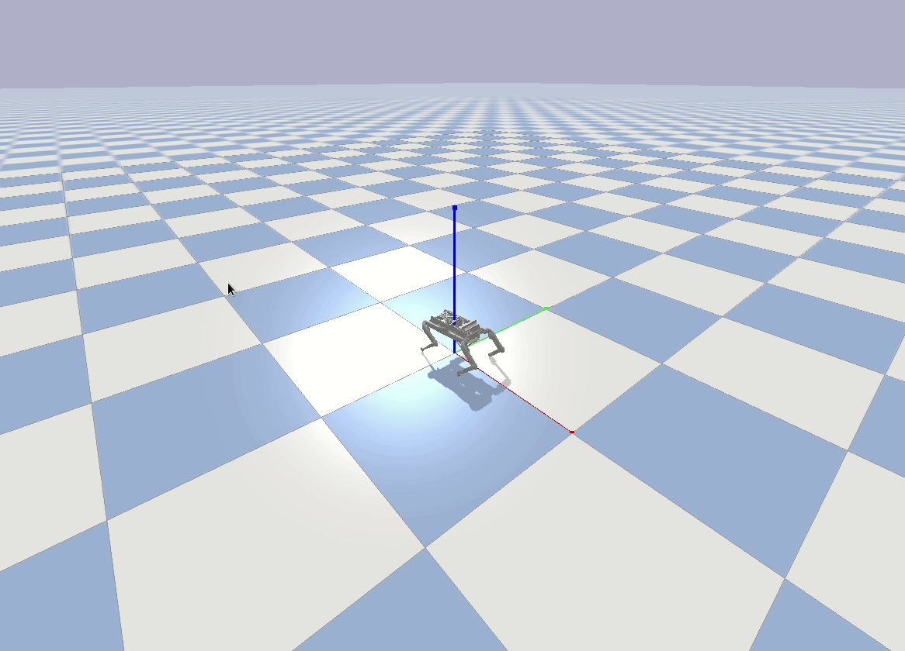

# WPI MMR Solo Quadrupedal Trot Controller

A quick and dirty controller to illustrate the power of having a continuous
sim2reality pipeline. While the controller is rudimentary; it took less than a
day to make and looks good enough:

